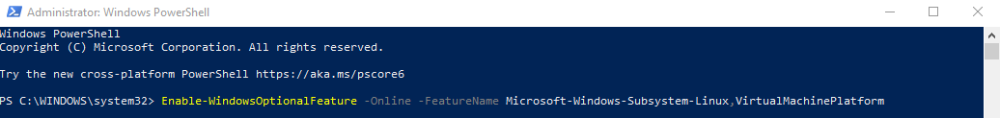
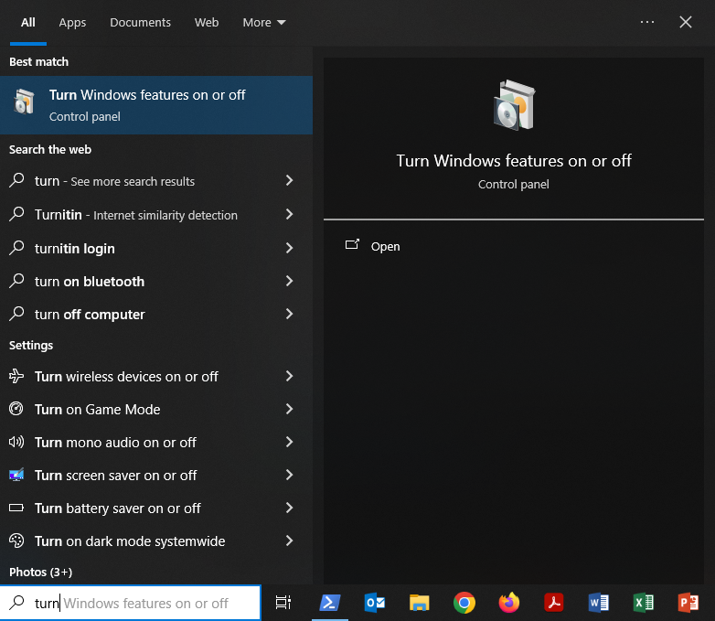
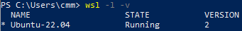

# Windows Subsystem for Linux Installation Guide for Windows 10

## Disclaimer

When we refer the "Linux operating system", we really mean the "GNU/Linux operating system" because GNU is actually the original part of the software. Linux is the kernel, i.e. "the program in the system that allocates the machine's resources to the other programs that you run", or simply the software that establishes the communication between the remaining parts of the system's software and the computer's hardware components.
For historical and eventually marketing reasons, the "GNU" designation has been neglecenciated by the industry that adopted the "Linux" designation for the entire system, which is obviously not accurate since the kernel doesn't run on it's own, but even if it could, it would be just useless.

For additional information about this subject:

- [What's in a name?](https://www.gnu.org/gnu/why-gnu-linux.html)
- [Linux and the GNU System](https://www.gnu.org/gnu/linux-and-gnu.html)
- [GNU Users Who Have Never Heard of GNU](https://www.gnu.org/gnu/gnu-users-never-heard-of-gnu.html)
- [GNU/Linux FAQ](https://www.gnu.org/gnu/gnu-linux-faq.html)

## Make sure that Windows is up to date

1. Type `update` in your Windows search bar:


then click `Check for Updates`:


then download and install any updates that appear in the Windows Update menu (shown below):


After you're done installing those updates, please [check which OS build of Windows 10 you are running](https://support.microsoft.com/en-us/help/13443/windows-which-version-am-i-running), and if your OS build number is smaller that `19041.XXX`, then please keep coming back to Windows Update and installing updates until you have at least OS build `19041.XXX`. Then you may proceed with this guide.


## Install the Windows Subsystem for Linux

Before installing any Linux distributions for WSL, you must ensure that the `Windows Subsystem for Linux` optional feature is enabled.  
Following, you have two possible ways of doing this (approaches 1 and 2). You may use the one you find more convenient.

### Approach 1:

1. Open `PowerShell` as Administrator by typing `PowerShell` in your Windows search bar:


and then clicking `Run as Administrator`:


2. Then paste the following command in `PowerShell`:

```powershell
Enable-WindowsOptionalFeature -Online -FeatureName Microsoft-Windows-Subsystem-Linux,VirtualMachinePlatform
```



and run it by pressing <kbd>enter</kbd>.

3. Restart your computer if asked to.

### Approach 2:

1. Enable Windows Subsystem for Linux and Virtual Machine Platform using the Windows interface from _Turn Windows features on or off_:



2. In the menu, activate the required checkboxes:


and click `OK` to finish.

3. Restart your computer if asked to.

## Install Ubuntu

1. Open this link to the [Microsoft Store](https://apps.microsoft.com/detail/9PN20MSR04DW?hl=en-gb&gl=GB) and select `Download` to install `Ubuntu`.

## Launch Ubuntu

To complete the initialization of your newly installed `Ubuntu`, launch a new instance. You can either do this:

- by clicking the `Open` or `Launch` button in the Microsoft Store page after the download is finished:

  

- or by typing `ubuntu` in your Windows search bar:


The first time the newly installed `Ubuntu` runs, a `Console` window will open.

- If you get this error:

  

  Go to [Download the Linux kernel update package](https://learn.microsoft.com/en-us/windows/wsl/install-manual#step-4---download-the-linux-kernel-update-package), download the _update package_ in step "1. Download the latest package:" and install it.  
  Then, go back to the console, press any key to continue and `open` or `launch` Ubuntu again using any of the two previous mentioned methods (Microsoft Store or the Windows search bar).

- If you don't get the previous error, you're good to go.

You'll now be asked to wait for a minute or two for the installation to complete.

> During this final stage of installation, `Ubuntu`'s files are de-compressed and stored on your PC, ready for use. This may take around a minute or more depending on the performance of your PC's storage devices. This initial installation phase is only required on the first launch - all future launches should take less than a second.

## Setting up a new Linux user account

Once the installation is complete, you will be prompted to create a new user account (and its password).


This user account is for the normal non-admin user that you'll be logged-in by default when launching `Ubuntu`.

> You can choose any username and password you wish - they have no bearing on your Windows username. Beware that when you type passwords in the terminal, you will not see what you are typing. This is a normal behavior in Linux. Just type the password and hit <kbd>Enter</kbd>.

When you open a new `Ubuntu` instance, you won't be prompted for your password, but **if you elevate a process using `sudo`, you will need to enter your password**, so make sure you choose a password you can easily remember! On `Ubuntu`, every user can do admin tasks such as installing software, but they have to use the magic `sudo` word and input the password. This tells `Ubuntu` that you will be acting as admin in the next moments.

> ⚠️ **Important: Do not forget this password (along with the associated username)**, as you'll not be able to see it again. It is your access card to perform operating system actions that require administrator privileges such as installation of some necessary features to work through the course.

## Setting defaults

If this is the first time WSL is enabled in your computer and you have never installed any Linux distribution, you can skip the next steps and move to [Opening the WSL terminal](#opening-the-wsl-terminal)

If you are unsure about it, or you have either enabled WSL previously or installed another Linux distribution before, proceed as follows:

1. Close the Ubuntu console

2. Run Windows Powershell using the Windows search bar as described in [Install the Windows Subsystem for Linux](#install-the-windows-subsystem-for-linux)

3. In the Powershell execute the following command:

   ```powershell
   wsl -l -v
   ```

   - If the output includes the following `Ubuntu-22.04` line, with this exact configuration (including the asterisk character `*`, `Running` and `2`):

     

     you can skip the next steps and move to [Opening the WSL terminal](#opening-the-wsl-terminal)

   - If the output doesn't include the previous `Ubuntu-22.04` line with this exact configuration (including the asterisk character `*`, `Running` and `2`), proceed as follows:

4. In the Powershell, set WSL 2 as the default Windows Subsystem for Linux:

   ```powershell
   wsl --set-default-version 2
   ```

5. In the Powershell, set Ubuntu 22.04 as the default Linux distribution:

   ```powershell
   wsl --set-default Ubuntu-22.04
   ```

> These two last steps will ensure that Windows always runs the appropriated versions of the enabled and installed features.

## Opening the WSL terminal

> ⚠️ **Important**: From now on, every time we ask you to open a terminal, this is what you need to do. We'll refer to it just as `terminal` instead of `WSL terminal` or `Ubuntu terminal`.

Whenever you want to use WSL, just type `ubuntu` in your Windows search bar.


Open it:


Then a `terminal` window will open that allows you to interact with `Ubuntu`.


## Enable copy and paste keyboard shortcuts

By default, the terminal does not allow the usual shortcuts for copying and pasting - you have to enable them first. In the upper left corner of the WSL terminal, click the orange square, and then click `Properties`:


Then under the `Options` tab, in the `Edit Options` section, make sure that `Use Ctrl+Shift+C/V as Copy/Paste` in enabled and click `OK`:


## Update & upgrade Ubuntu's software packages

Most Linux distributions ship with an empty/minimal software package catalog. We strongly recommend regularly updating your package catalog, and upgrading your installed packages using the appropriate package manager. On `Ubuntu`, you use the `apt` package manager. The following command will check for software updates and install them:

```bash
sudo apt update && sudo apt upgrade
```

> Windows does not automatically update or upgrade your Linux distribution. This is a task that the Linux users prefer to control themselves.

## How to open Windows File Explorer to manipulate files inside WSL

If you’d like to use `Windows File Explorer` to manipulate the files in WSL, just type this in the `terminal`. **(Don't forget to include the dot! The dot means "current directory")**:

```console
explorer.exe .
```

The `Windows Explorer` should pop up:


If you wish, you can also access your user folder directly from the Windows Explorer address bar using this path: `\\wsl.localhost\Ubuntu-22.04\home\<YOUR USERNAME>`. This is exactly the same as calling the Windows Explorer from within your Ubuntu user folder with the `.` option.

Keep in mind that you should manipulate files and create directories inside your `Ubuntu-22.04/home/<your name>` folder.

You're all set with WSL! Never imagined yourself using the wonderful GNU/Linux operating system? Don't worry too much about it. First because the LDSA team will be with you all the way, and second, well... Microsoft didn't also, but eventually things change... 😉


_[Thomas C Greene @ The Register - Jun 2001](https://www.theregister.com/2001/06/02/ballmer_linux_is_a_cancer/)_


_[Microsoft (19 contributors) @ learn.microsoft.com - Nov 2023](https://learn.microsoft.com/en-us/windows/wsl/about#microsoft-loves-linux)_

That's it! Time to go back to the initial setup for Windows and continue with [step 3](https://github.com/LDSSA/ds-prep-course-2024/tree/readme-update-cmm79#3-setup-git-and-github).
